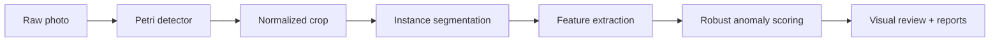
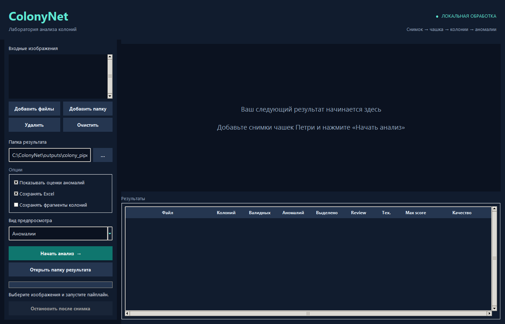

<p align="center">
  
</p>

<p align="center">
  <strong>Local computer vision for Petri-dish colony analysis.</strong><br>
  Detection, instance segmentation, interpretable features, and anomaly review in one Windows application.
</p>

<p align="center">
  <a href="../../actions/workflows/checks.yml"></a>
  
  
  
</p>

## What it does

ColonyNet turns a raw photograph into a reviewable laboratory report. It finds the Petri dish, isolates individual colonies, measures their morphology and appearance, and highlights objects that differ from their local context.

| Stage | Output |
| --- | --- |
| Petri detection | Dish bounding box and normalized 736 × 736 crop |
| Colony segmentation | Non-overlapping instance masks |
| Feature extraction | Shape, colour, texture, neighbourhood, and mask-quality features |
| Anomaly analysis | Ranked candidates with human-readable evidence |
| Reporting | Stage images, CSV tables, and an optional Excel workbook |



Everything runs on the workstation. The inference process enables offline mode before loading Ultralytics and disables supported telemetry and experiment-tracking integrations. See [SECURITY.md](SECURITY.md) for the exact boundary.

## Desktop application

The interface accepts individual images or folders, shows every processing stage, reports progress, and creates a separate directory for each run. Processing can be stopped safely after the current image.

<p align="center">
  
</p>

## Quick start

Requirements: Windows, Python 3.10 or 3.11, and two trusted local model files.

```powershell
git clone https://github.com/ArtemFiend/ColonyNet.git
cd ColonyNet
py -3.10 -m venv .venv
.\.venv\Scripts\python.exe -m pip install -e .
```

Place the models in `src/colonynet/models/`:

| File | SHA-256 of the validated local model |
| --- | --- |
| `petri_detector_yolo26s_best.pt` | `adc76b3226de7f219d8da9a3afecd45d9d4729b80ce6e44a9f99341d5108223f` |
| `colony_yolo26x_seg_best.pt` | `4aa01bb1c43c1484820c22faafbfa5553cc255c3813595beee887a787f67e2f5` |

Model weights are deliberately absent from the repository. PyTorch checkpoints can contain executable objects; only use files you trust.

```powershell
# Validate the installation and local models
.\.venv\Scripts\python.exe -m colonynet.app --self-test

# Open the desktop application
.\run.ps1

# Process one image without the GUI
.\.venv\Scripts\python.exe -m colonynet.app --run-once "plate.jpg" --output "outputs/demo"
```

PyTorch installation differs by CPU/CUDA platform. If GPU acceleration is required, install the matching official PyTorch build before `pip install -e .`.

## Project structure

```text
src/colonynet/
├── app.py          # Windows desktop interface
├── pipeline.py     # Detection, segmentation, features, and scoring
├── runtime.py      # Offline defaults and safe file handling
└── models/         # Local weights (ignored by Git)
examples/           # Minimal Python usage
packaging/          # PyInstaller configuration
scripts/            # Repository safety checks
tests/              # Fast safeguards and integration tests
docs/               # Architecture and model limitations
```

## Validation

The checked release was exercised with an end-to-end local image run, desktop-widget smoke test, dependency audit, and automated safeguards for:

- offline import behaviour;
- output filename collisions;
- spreadsheet formula injection;
- secret and binary-artifact publication;
- empty-detection handling.

```powershell
.\.venv\Scripts\python.exe -m unittest discover -s tests -v
.\.venv\Scripts\python.exe scripts/check_repository.py
```

An anomaly score is a review priority, not a biological diagnosis or probability. Read [docs/MODEL_CARD.md](docs/MODEL_CARD.md) before interpreting results.

## Windows build

```powershell
.\.venv\Scripts\python.exe -m pip install pyinstaller
.\build.ps1
.\dist\ColonyNet\ColonyNet.exe --self-test
```

The generated `dist/` directory and embedded weights are excluded from Git.
