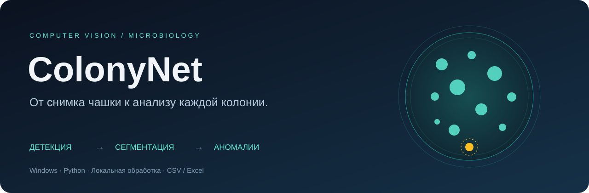

# ColonyNet

Локальное Windows-приложение для анализа изображений чашек Петри: поиск чашки, сегментация отдельных колоний, морфологические признаки и интерпретируемый поиск аномалий. В репозитории также сохранены инструменты подготовки датасетов и обучения SegFormer/YOLO.

**[Запуск приложения](#быстрый-запуск) · [Безопасность](SECURITY.md) · [Сборка Windows](full_pipline/EXE_README.md) · [Полный pipeline](full_pipline/README.md)**

| Возможность | Что получает пользователь |
| --- | --- |
| Анализ снимков и папок | Детекция чашки → crop 736 × 736 → instance segmentation |
| Просмотр по этапам | Исходник, рамка чашки, crop, цветные маски и аномалии |
| Отчёты | CSV, Excel, изображения этапов и необязательные фрагменты колоний |
| Контроль обработки | Прогресс, остановка после текущего снимка, отдельная папка запуска |
| Локальная работа | Без загрузки снимков на сервер; телеметрия inference отключена |

## Быстрый запуск

Нужны Windows, Python 3.10 и **две обученные модели**. Веса и приватные датасеты не входят в Git. Поместите доверенные веса в `full_pipline/models/`:

```text
full_pipline/models/
├── petri_detector_yolo26s_best.pt
└── colony_yolo26x_seg_best.pt
```

```powershell
py -3.10 -m venv .venv-app
.\.venv-app\Scripts\python.exe -m pip install -r requirements-app.txt
.\.venv-app\Scripts\python.exe -m full_pipline.colony_pipeline_app --self-test
.\start_colonynet.ps1
```

В интерфейсе добавьте снимки, выберите папку результатов и нажмите **«Начать анализ»**. Снимки с одинаковыми именами без расширения нужно переименовать: приложение проверяет это до запуска. Повторный запуск GUI создаёт новый каталог `analysis_<дата>_<id>`.

Для одного изображения без интерфейса:

```powershell
.\.venv-app\Scripts\python.exe -m full_pipline.colony_pipeline_app --run-once "image.jpg" --output "outputs/demo"
```

Для GPU установите подходящую пару PyTorch/torchvision для своего CUDA-окружения перед остальными зависимостями. На CPU большая модель сегментации и проверка устойчивости аномалий могут работать заметно дольше. `--self-test` проверяет наличие весов; полный запуск проверяет их совместимость и вычисления.

## Данные и воспроизводимость

- Исходные снимки, результаты, веса, базы MLflow и сборки исключены из Git.
- `tools/prepare_release.py .release/source` создаёт отдельную копию исходников, очищает выводы/вложения notebooks и проверяет распространённые форматы секретов, сохраняя оригинальные notebooks на компьютере.
- Разбиение `train.py` группирует оригинал и его `__softNN`-аугментации; явные списки train/val проверяются на пересечения исходных идентификаторов.
- Поиск аномалий — инструмент исследовательского анализа. Выделенный объект требует проверки; score не является вероятностью биологической аномалии. Независимые метрики нужно получать на отдельном test-наборе.

```powershell
.\.venv\Scripts\python.exe -m unittest discover -s tests -v
.\.venv\Scripts\python.exe tools/smoke_desktop.py
```

## Структура проекта

```text
full_pipline/   Windows GUI, inference и сборка EXE
colonyseg/     Модели SegFormer, данные, метрики, watershed
configs/       Конфигурации обучения и последовательных запусков
tools/         Подготовка данных, оценка, экспорт чистых исходников
tests/         Проверки изоляции выборок и безопасной работы с файлами
notebooks/     Исследовательские сценарии
```

## Обучение и исследовательские инструменты

### SegFormer MiT-B2/B3 + sem/center/boundary + watershed

ColonyNet trains instance segmentation with 3 heads:
- `sem`: foreground (colony/cell) vs background
- `center`: instance center heatmap
- `boundary`: boundaries between instances

Instances are recovered with marker-controlled watershed.

## Requirements
```bash
pip install -r requirements.txt
```

## Expected Dataset Format
Each dataset must be a pair of folders:
- `images/*` (`.png`, `.jpg`, `.jpeg`, `.tif`, `.tiff`, `.bmp`)
- `instances/*.png` (integer instance ids)

Mask format:
- `0` = background
- `1..N` = instance IDs
- `uint16` PNG is supported and recommended for many objects

## Training
Run training with a config:
```bash
python train.py --config configs/train_trainable_pool_mit_b3.yaml
```

Most used configs:
- `configs/train_trainable_pool_mit_b2.yaml`
- `configs/train_trainable_pool_mit_b3.yaml`
- `configs/train_unified_mit_b2.yaml`
- `configs/train_unified_mit_b3.yaml`
- `configs/train_unified_petri_mit_b2.yaml`
- `configs/train_unified_petri_mit_b3.yaml`
- `configs/train_cups_mit_b2.yaml`
- `configs/train_cups_mit_b3.yaml`

For `train_trainable_pool_*` configs, training/validation use:
- `trainable_pool/images`
- `trainable_pool/instances`

Validation split is controlled by `data.val_split` in config.

Model selection can be defined explicitly in YAML:
```yaml
model:
  model_variant: mit-b3        # shortcut: mit-b2/mit-b3 or full HF id
  backbone_id: nvidia/mit-b3   # optional if model_variant is enough
  fpn_dim: 256
```

CLI overrides are available too:
```bash
python train.py --config configs/train_trainable_pool_mit_b3.yaml --model_variant mit-b2
python train.py --config configs/train_trainable_pool_mit_b3.yaml --model_variant facebook/convnext-tiny-224
python train.py --config configs/train_trainable_pool_mit_b3.yaml --backbone_id nvidia/mit-b3
```

### Pipeline Runner
For sequential multi-stage runs (including two-stage and notebook pipelines), use:
```bash
python tools/run_pipeline.py --pipeline <name_or_yaml>
```

Built-in pipeline presets:
- `two_stage_mit_b3` -> `configs/pipelines/two_stage_mit_b3.yaml`
- `all_train_configs` -> `configs/pipelines/all_train_configs.yaml`
- `two_stage_notebooks` -> `configs/pipelines/two_stage_notebooks.yaml`

Dedicated MLflow model presets:
- `configs/mlflow_models/mit_b2/*`
- `configs/mlflow_models/mit_b3/*`
- `configs/mlflow_models/unetpp/*`
- all-in-one: `configs/mlflow_models/run_all.yaml`

Examples:
```bash
python tools/run_pipeline.py --pipeline two_stage_mit_b3 --mlflow --mlflow_experiment colony_segmentation
python tools/run_pipeline.py --pipeline all_train_configs --model_variant mit-b3 --run_name_suffix exp01
python tools/run_pipeline.py --pipeline two_stage_notebooks
python tools/run_pipeline.py --pipeline configs/mlflow_models/run_all.yaml --continue_on_error
```

Pipeline artifacts are stored in:
- `runs/pipelines/<pipeline_name>_<timestamp>/summary.json`

For notebook stages, `jupyter`/`nbconvert` must be installed.

### Training With MLflow
Example config with MLflow + test image segmentation check:
- `configs/train_trainable_pool_mit_b3_mlflow.yaml`

Start MLflow server (optional, if using local UI):
```bash
mlflow server --host 127.0.0.1 --port 5000
```

Run training with MLflow from config:
```bash
python train.py --config configs/train_trainable_pool_mit_b3_mlflow.yaml
```

CLI overrides are also available:
```bash
python train.py --config configs/train_trainable_pool_mit_b3.yaml --mlflow --mlflow_tracking_uri http://127.0.0.1:5000 --mlflow_experiment colony_segmentation
```

What is logged:
- Params from YAML config
- Epoch metrics (`train_loss`, `val_f1`, `val_merge`, `val_split`, etc.)
- Artifacts: `best.pt`, `last.pt`, `history.json`, `history.png`
- Optional test segmentation artifacts and metrics from `test_seg` config section

## Inference
```bash
python infer.py --ckpt runs/<run_name>/best.pt --input_dir trainable_pool/images --out_dir runs/demo_preds
```

## Test Image Segmentation Evaluation
Run petri-crop + inference + watershed on a single image and compare with reference masks:
```bash
python tools/eval_test_seg.py --ckpt runs/<run_name>/best.pt --image_path test_seg/IMG_4677.jpg --reference_path test_seg/IMG_4677 --out_dir runs/<run_name>/test_seg_eval --mask_outside
```

Artifacts include:
- `pred_labels.png`
- `pred_overlay.png`
- `gt_labels.png` (if reference provided)
- `agreement_map.png` (TP/FP/FN)
- `comparison_panel.png`
- `report.json`

## Dataset Conversion Utilities
- DSB2018 -> instance masks:
```bash
python tools/convert_dsb2018.py --dsb_root /path/to/stage1_train --out_root data/dsb2018
```
- Build merged training pool:
```bash
python tools/build_trainable_pool.py --data_root data --all_root all_datasets --stage1_root stage1_train --out_root trainable_pool
```

## Notes
- Model heads predict at `1 / out_stride` resolution (`out_stride=4` by default).
- Ground-truth instances are downscaled with nearest-neighbor interpolation before target building.
- Watershed postprocessing thresholds are configured in each training YAML under `post`.
